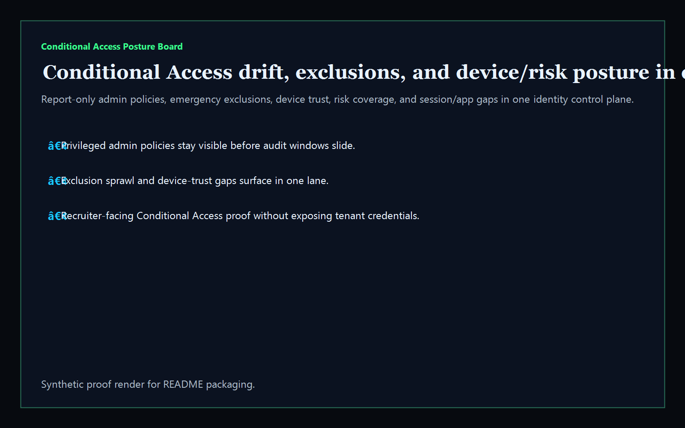
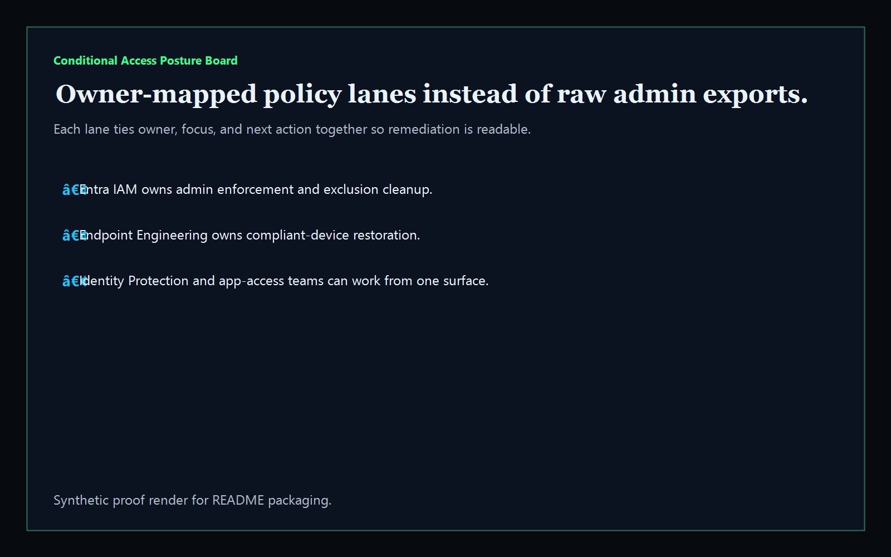
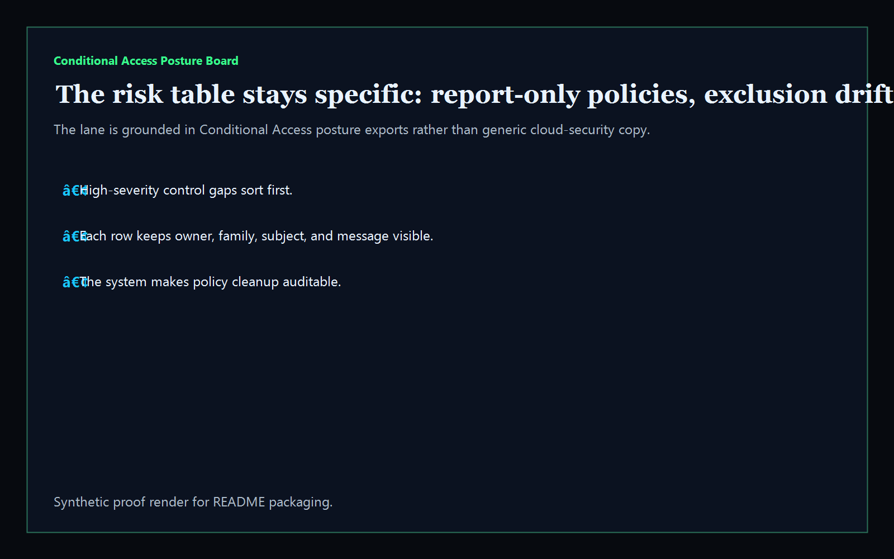
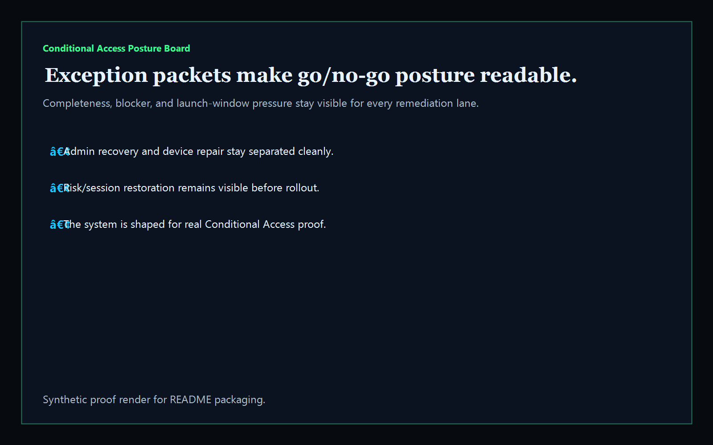

# Conditional Access Posture Board

[](https://github.com/mizcausevic-dev/conditional-access-posture-board/actions/workflows/ci.yml)
[](https://github.com/mizcausevic-dev/conditional-access-posture-board/actions/workflows/pages.yml)

Operator control plane for Conditional Access policy posture, exclusions, device trust, sign-in risk coverage, app targeting, and remediation sequencing.

## Why this exists

- Conditional Access posture gets dangerous when it stays trapped in policy exports and admin consoles instead of one operator-readable surface.
- Admin enforcement, exclusion hygiene, compliant-device checks, risk coverage, and session controls need to stay visible together before audit or incident windows slide.
- Recruiters looking for `Azure / Entra / Conditional Access / Intune / identity governance` should see a real operator dashboard, not a keyword page.

## Why this matters

This repo demonstrates the identity-governance control-plane primitive for Conditional Access operations: policy bundles, control gaps, and exception posture in one operator surface. Kinetic Gain Embedded extends this pattern into productized in-app dashboards where platform, IAM, and security teams need evidence-rich surfaces without exposing raw admin backends or tenant credentials. See [https://kineticgain.com/embedded](https://kineticgain.com/embedded).

## What it shows

- `policy-lane` visibility for privileged admin, device trust, risk/session, and app-targeting cleanup
- `control-gaps` detection for report-only admin policies, exclusion sprawl, device-trust gaps, missing risk coverage, weak session controls, and uncovered apps
- remediation packets for admin recovery, device repair, risk/session restoration, and app targeting cleanup
- offline-safe analysis of captured posture exports
- recruiter-facing Microsoft / Entra / Conditional Access proof that complements Intune, Defender, AWS, and GCP lanes

## Routes

- `/`
- `/policy-lane`
- `/control-gaps`
- `/exception-posture`
- `/verification`
- `/docs`

## API

- `/api/dashboard/summary`
- `/api/policy-lane`
- `/api/control-gaps`
- `/api/exception-posture`
- `/api/verification`
- `/api/sample`

## Proof






## CLI

```powershell
npx conditional-access-posture fixtures/conditional-access-posture.json --format summary
```

## Local development

```powershell
cd conditional-access-posture-board
npm install
npm run dev
```

Open:

- [http://127.0.0.1:5521/](http://127.0.0.1:5521/)
- [http://127.0.0.1:5521/policy-lane](http://127.0.0.1:5521/policy-lane)
- [http://127.0.0.1:5521/control-gaps](http://127.0.0.1:5521/control-gaps)
- [http://127.0.0.1:5521/exception-posture](http://127.0.0.1:5521/exception-posture)

## Validation

```powershell
npm run verify
npm run prerender
npm run render:assets
```

## Deployment

| Surface | Value |
|---|---|
| GitHub Pages | workflow-based |
| CNAME | `access.kineticgain.com` |
| Live site | [https://access.kineticgain.com/](https://access.kineticgain.com/) |
| Data posture | Synthetic sample data only; no live tenant credentials or production exports |

## Documentation

- [Embedded tie-back](./docs/KINETIC_GAIN_EMBEDDED.md)
- [Architecture](./docs/architecture.md)
- [Origin](./docs/ORIGIN.md)

## Part of the Kinetic Gain Suite

Operator surface in the [Kinetic Gain Suite](https://suite.kineticgain.com/) — a portfolio of buyer-readable control planes spanning security posture, compliance evidence, data-platform governance, FinOps, and operator workflows. See the suite index for related surfaces. Apex: [kineticgain.com](https://kineticgain.com/).
